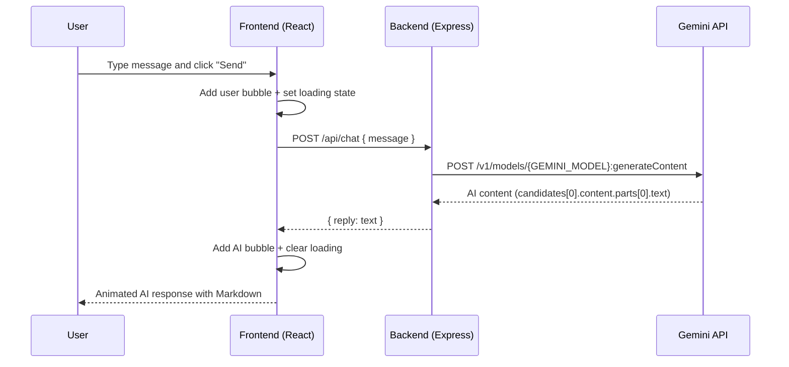

# NeuraTalk – AI Chatbot Web App

NeuraTalk is a modern, responsive AI chatbot web application built with **React + Vite** on the frontend and **Node.js + Express** on the backend, integrated with **Google Gemini** for AI responses.

The design is optimized for a **dark, futuristic, startup‑grade** feel with glassmorphism, gradients, and smooth animations.

---

## Features

- Dark, futuristic UI with glassmorphism and neon gradients
- Fully responsive (mobile, tablet, desktop)
- Smooth animations using **Framer Motion**
- AI chat powered by **Google Gemini**
- Typing indicator and loading state
- Auto‑scroll to latest message
- Error handling with friendly messages
- Markdown‑rendered AI responses
- Welcome AI message on first load
- Clear chat button

---

## Tech Stack

**Frontend**

- React (Vite)
- Tailwind CSS
- Framer Motion
- Axios
- React Markdown

**Backend**

- Node.js
- Express.js
- Native `fetch` to call the Gemini HTTP API
- dotenv
- CORS

---

## Project Structure

```text
.
├── server/                    # Node + Express backend
│   ├── index.js               # Express app entry
│   ├── controllers/
│   │   └── geminiController.js  # Gemini integration and chat handler
│   ├── routes/
│   │   └── chat.js            # /api/chat route
│   ├── .env                   # Backend environment variables (not committed)
│   └── package.json
│
└── client/                    # React + Vite frontend
    ├── index.html             # HTML shell (includes favicon + fonts)
    ├── vite.config.js         # Vite configuration
    ├── tailwind.config.cjs    # Tailwind theme/customizations
    ├── postcss.config.cjs
    ├── public/
    │   └── neuratalk-logo.png # Chatbot logo used in UI and tab icon
    └── src/
        ├── main.jsx           # React bootstrap
        ├── App.jsx            # Root component
        ├── index.css          # Global styles + Tailwind imports
        ├── pages/
        │   └── Home.jsx       # Landing page + header layout
        └── components/
            ├── ChatBox.jsx       # Chat UI, state, and API calls
            ├── MessageBubble.jsx # User/AI bubbles with Markdown
            └── TypingIndicator.jsx # Animated typing dots
```

---

## High‑Level Architecture

### System Diagram

```mermaid
graph TD
  User[User Browser] --> Frontend[NeuraTalk Frontend (Vite + React)]
  Frontend -->|Axios POST /api/chat| Backend[NeuraTalk API (Express)]
  Backend -->|HTTP v1 generateContent| Gemini[Google Gemini API]
  Gemini --> Backend
  Backend -->|JSON { reply }| Frontend
```

### Request Flow



---

## Backend – Setup and Usage

Backend path: `server/`

### Environment Variables

Create a `.env` file inside `server/`:

```env
GEMINI_API_KEY=your_real_gemini_api_key_here
PORT=5000
GEMINI_MODEL=gemini-1.5-flash
```

- `GEMINI_API_KEY` – **required**, your Gemini API key from Google AI Studio.
- `PORT` – port for the Express server (default `5000`).
- `GEMINI_MODEL` – optional; defaults to `gemini-1.5-flash` if not set.

> Never commit `.env` to Git. It must stay local or on your server host (e.g., Vercel/Render secrets).

### Install Dependencies

From the project root:

```bash
cd server
npm install
```

### Run Backend (Development)

```bash
cd server
npm run dev
```

The server starts on `http://localhost:5000`.

Health check:

```bash
GET http://localhost:5000/
```

should respond:

```json
{ "status": "NeuraTalk API running" }
```

### Chat Endpoint

- **URL:** `POST /api/chat`
- **Body:**

```json
{
  "message": "Your question here"
}
```

- **Response:**

```json
{
  "reply": "AI response text from Gemini"
}
```

On error, the backend returns:

```json
{
  "error": "Human‑readable error message"
}
```

The frontend surfaces this message in the error UI.

---

## Gemini Integration (Backend Internals)

File: `server/controllers/geminiController.js`

Key responsibilities:

- Validate that `GEMINI_API_KEY` is set.
- Validate that the incoming request has a non‑empty `message` string.
- Call the Gemini HTTP API:

```text
POST https://generativelanguage.googleapis.com/v1/models/${GEMINI_MODEL}:generateContent?key=${GEMINI_API_KEY}
```

with body:

```json
{
  "contents": [
    {
      "parts": [
        { "text": "user message here" }
      ]
    }
  ]
}
```

- Extract the text from `candidates[0].content.parts[0].text`.
- Return a simplified JSON payload `{ reply: text }`.
- On failure, log the error and respond with an informative message.

---

## Frontend – Setup and Usage

Frontend path: `client/`

### Environment Variable (API base URL)

The frontend needs to know where the backend is deployed.

In development, `ChatBox.jsx` uses a base URL that can be configured via Vite:

```js
const API_BASE_URL = import.meta.env.VITE_API_BASE_URL || "http://localhost:5000";
```

Create a `.env` file inside `client/` for local overrides if needed:

```env
VITE_API_BASE_URL=http://localhost:5000
```

### Install Dependencies

```bash
cd client
npm install
```

### Run Frontend (Development)

```bash
cd client
npm run dev
```

Vite will start the dev server, usually at:

```text
http://localhost:5173
```

With both frontend and backend running, open that URL to use NeuraTalk.

---

## UI / UX Overview

### Layout

- **Header**
  - NeuraTalk logo (robot image) + brand name in a custom Orbitron‑style font.
  - Subtitle: “Your intelligent AI assistant for ideas, code, and conversations.”
  - Status pill: “Powered by Google Gemini Pro”.

- **Chat Container**
  - Centered glass card with rounded corners and glow.
  - Header bar showing “NeuraTalk Chat” and a “Clear chat” button.
  - Scrollable chat area.
  - Sticky bottom input with textarea + Send button.

### Message Styles

- **User messages**
  - Right‑aligned.
  - Blue bubble with subtle shadow.

- **AI messages**
  - Left‑aligned.
  - Dark bubble with purple edge glow.
  - Markdown rendered via `react-markdown` (bold, lists, code, etc.).

### Interactions

- **Typing and Loading**
  - While waiting for a response, a typing indicator with 3 animated dots appears.

- **Keyboard**
  - Enter to send (single‑line).
  - Shift+Enter for a new line in the textarea.

- **Auto‑scroll**
  - Chat scrolls automatically to the latest message.

- **Error UI**
  - If the backend or Gemini call fails, a red alert bar appears above the input with a friendly error message.

---

## Deployment Guide (GitHub + Vercel Example)

You can host NeuraTalk using:

- **Frontend:** Vercel (React/Vite)
- **Backend:** Any Node host (Vercel serverless functions, Render, Railway, etc.)

### 1. Push Code to GitHub

From the project root:

```bash
git init
git add .
git commit -m "Initial NeuraTalk version"

git branch -M main
git remote add origin https://github.com/<your-username>/neuratalk.git
git push -u origin main
```

Replace `<your-username>` with your GitHub username.

### 2. Deploy Frontend to Vercel

1. Go to Vercel and import your GitHub repo.
2. Framework preset: `Vite`.
3. Root directory: `client`.
4. Build command: `npm run build`.
5. Output directory: `dist`.
6. Environment variables:
   - `VITE_API_BASE_URL = https://your-backend-domain.com`
7. Deploy.

### 3. Deploy Backend (Example: Render / Railway)

1. Create a new web service linked to the same GitHub repo.
2. Root directory: `server`.
3. Install command: `npm install`.
4. Start command: `npm start`.
5. Environment variables:
   - `GEMINI_API_KEY` – your Gemini key
   - `PORT` – e.g., `5000` (or platform default)
   - `GEMINI_MODEL` – e.g., `gemini-1.5-flash`
6. Deploy and note the service URL, e.g.:

```text
https://neuratalk-api.onrender.com
```

7. Update Vercel frontend env:

```text
VITE_API_BASE_URL=https://neuratalk-api.onrender.com
```

8. Redeploy the frontend.

---

## Screenshots / Images (Optional)

To document UI visually in this README:

1. Take screenshots of:
   - Full desktop layout.
   - Mobile view (chat open).
2. Save them under `client/public/`, e.g.:

```text
client/public/screenshots/neuratalk-desktop.png
client/public/screenshots/neuratalk-mobile.png
```

3. Reference them here:

```markdown


```

---

## Future Enhancements

- Theme toggle (Dark vs. alternative neon themes)
- Persistent conversation history (local storage or backend)
- Authentication and user profiles
- More advanced prompt templates and personality modes

NeuraTalk is designed to be easy to customize for portfolios, SaaS demos, or startup landing pages. Feel free to adapt the styling, animations, and prompts to match your brand.

