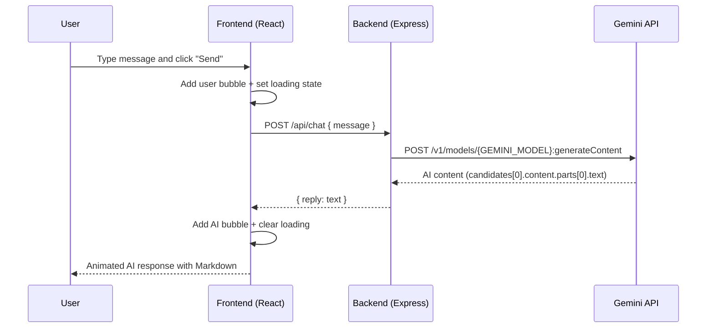
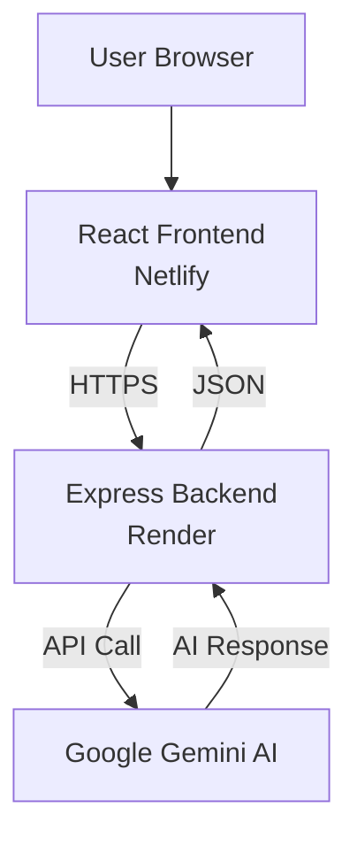
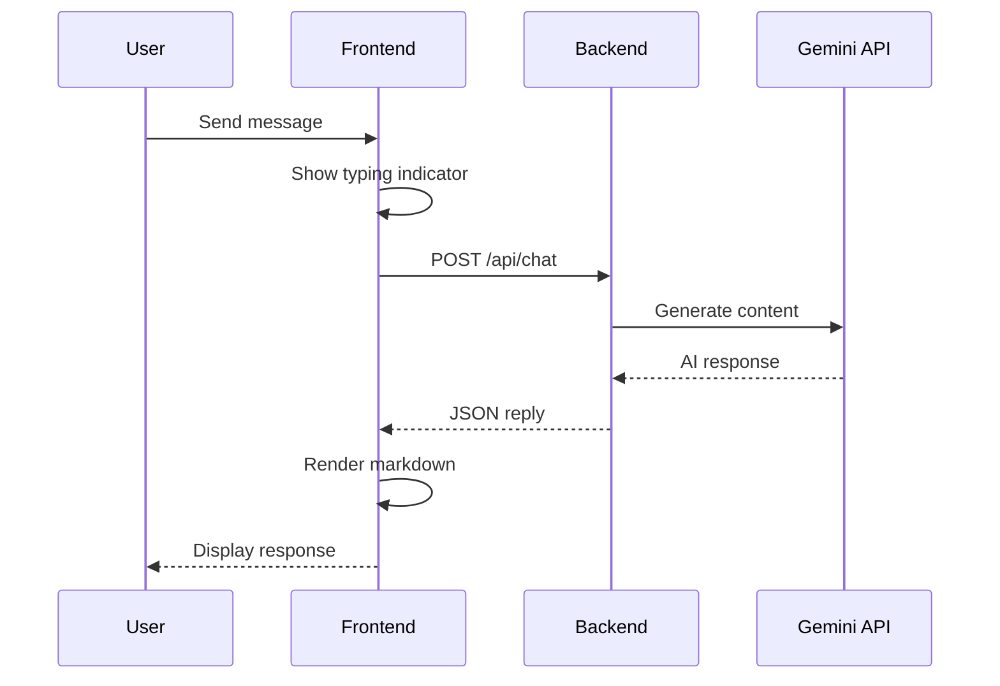

# NeuraTalk – AI Chatbot Web App

[](https://neuratalk-chatbot.netlify.app)
[](https://neuratalk-chatbot.netlify.app)
[](https://neuratalk-kwsm.onrender.com)

NeuraTalk is a modern, responsive AI chatbot web application built with **React + Vite** on the frontend and **Node.js + Express** on the backend, integrated with **Google Gemini AI** for intelligent conversations.

The design features a **dark, futuristic UI** with glassmorphism effects, neon gradients, smooth animations, and voice input support.

---

## ✨ Features

- 🎨 **Dark Futuristic UI** with glassmorphism and neon gradients
- 📱 **Fully Responsive** design (mobile, tablet, desktop)
- ✨ **Smooth Animations** using Framer Motion
- 🤖 **AI-Powered Chat** with Google Gemini 2.5 Flash
- 🎙️ **Voice Input** support with Web Speech API
- ⌨️ **Markdown Rendering** for AI responses
- 💬 **Typing Indicator** with loading states
- 🔄 **Auto-scroll** to latest messages
- ⚡ **Real-time Error Handling** with user-friendly messages
- 🧹 **Clear Chat** functionality
- 🎯 **Welcome Message** on first load

---

## 🛠️ Tech Stack

### Frontend
- **React 18** - UI library
- **Vite** - Build tool and dev server
- **Tailwind CSS** - Utility-first styling
- **Framer Motion** - Animation library
- **Axios** - HTTP client
- **React Markdown** - Markdown rendering

### Backend
- **Node.js** - Runtime environment
- **Express.js** - Web framework
- **Google Generative AI SDK** - Gemini API integration
- **dotenv** - Environment configuration
- **CORS** - Cross-origin resource sharing

### Deployment
- **Frontend**: Netlify
- **Backend**: Render
- **Version Control**: GitHub

---

## Project Structure

```text
.
├── server/                    # Node + Express backend
│   ├── index.js               # Express app entry
│   ├── controllers/
│   │   └── geminiController.js  # Gemini integration and chat handler
│   ├── routes/
│   │   └── chat.js            # /api/chat route
│   ├── .env                   # Backend environment variables (not committed)
│   └── package.json
│
└── client/                    # React + Vite frontend
    ├── index.html             # HTML shell (includes favicon + fonts)
    ├── vite.config.js         # Vite configuration
    ├── tailwind.config.cjs    # Tailwind theme/customizations
    ├── postcss.config.cjs
    ├── public/
    │   └── neuratalk-logo.png # Chatbot logo used in UI and tab icon
    └── src/
        ├── main.jsx           # React bootstrap
        ├── App.jsx            # Root component
        ├── index.css          # Global styles + Tailwind imports
        ├── pages/
        │   └── Home.jsx       # Landing page + header layout
        └── components/
            ├── ChatBox.jsx       # Chat UI, state, and API calls
            ├── MessageBubble.jsx # User/AI bubbles with Markdown
            └── TypingIndicator.jsx # Animated typing dots
```

---

## High‑Level Architecture

### System Diagram

```mermaid
graph TD
  User[User Browser] --> Frontend[NeuraTalk Frontend (Vite + React)]
  Frontend -->|Axios POST /api/chat| Backend[NeuraTalk API (Express)]
  Backend -->|HTTP v1 generateContent| Gemini[Google Gemini API]
  Gemini --> Backend
  Backend -->|JSON { reply }| Frontend
```

### Request Flow


```mermaid
sequenceDiagram
  participant U as User
  participant F as Frontend (React)
  participant B as Backend (Express)
  participant G as Gemini API

  U->>F: Type message and click "Send"
  F->>F: Add user bubble + set loading state
  F->>B: POST /api/chat { message }
  B->>G: POST /v1/models/{GEMINI_MODEL}:generateContent
  G-->>B: AI content (candidates[0].content.parts[0].text)
  B-->>F: { reply: text }
  F->>F: Add AI bubble + clear loading
  F-->>U: Animated AI response with Markdown
```

---

## 🚀 Quick Start

### Prerequisites
- Node.js 18+ installed
- Google Gemini API key ([Get one here](https://aistudio.google.com/app/apikey))
- Git

### Local Development Setup

1. **Clone the repository**
```bash
git clone https://github.com/gurudeepdeeps/neuratalk.git
cd neuratalk
```

2. **Setup Backend**
```bash
cd server
npm install

# Create .env file
echo "GEMINI_API_KEY=your_api_key_here" > .env
echo "PORT=5000" >> .env
echo "GEMINI_MODEL=gemini-2.5-flash" >> .env

# Start backend
npm run dev
```

3. **Setup Frontend** (in a new terminal)
```bash
cd client
npm install

# Create .env file (optional for local dev)
echo "VITE_API_BASE_URL=http://localhost:5000" > .env

# Start frontend
npm run dev
```

4. **Open your browser**
```
http://localhost:5173
```

### Environment Variables

**Backend (`server/.env`)**
```env
GEMINI_API_KEY=your_gemini_api_key
PORT=5000
GEMINI_MODEL=gemini-2.5-flash
```

**Frontend (`client/.env`)** (optional for local dev)
```env
VITE_API_BASE_URL=http://localhost:5000
```

> ⚠️ **Never commit `.env` files to Git!** They are already in `.gitignore`.

---

## 📡 API Reference

### Health Check
```http
GET /
Response: { "status": "NeuraTalk API running" }
```

### Chat Endpoint
```http
POST /api/chat
Content-Type: application/json

Request Body:
{
  "message": "Your question here"
}

Success Response (200):
{
  "reply": "AI response text from Gemini"
}

Error Response (4xx/5xx):
{
  "error": "Error description"
}
```

---

## Gemini Integration (Backend Internals)

File: `server/controllers/geminiController.js`

Key responsibilities:

- Validate that `GEMINI_API_KEY` is set.
- Validate that the incoming request has a non‑empty `message` string.
- Call the Gemini HTTP API:

```text
POST https://generativelanguage.googleapis.com/v1/models/${GEMINI_MODEL}:generateContent?key=${GEMINI_API_KEY}
```

with body:

```json
{
  "contents": [
    {
      "parts": [
        { "text": "user message here" }
      ]
    }
  ]
}
```

- Extract the text from `candidates[0].content.parts[0].text`.
- Return a simplified JSON payload `{ reply: text }`.
- On failure, log the error and respond with an informative message.

---

## 🌐 Deployment

### Production Deployment

The app is deployed using:
- **Frontend**: Netlify (Static hosting)
- **Backend**: Render (Node.js server)

### Deploy Your Own Instance

#### Backend on Render

1. Push your code to GitHub
2. Go to [render.com](https://render.com)
3. Create a new **Web Service**
4. Connect your repository
5. Configure:
   - **Root Directory**: `server`
   - **Build Command**: `npm install`
   - **Start Command**: `node index.js`
6. Add environment variables:
   - `GEMINI_API_KEY`: Your API key
   - `GEMINI_MODEL`: `gemini-2.5-flash`
7. Deploy
8. Copy your backend URL (e.g., `https://your-app.onrender.com`)

#### Frontend on Netlify

1. Go to [netlify.com](https://netlify.com)
2. Import your GitHub repository
3. Configure build settings:
   - **Build command**: `cd client && npm install && npm run build`
   - **Publish directory**: `client/dist`
4. Add environment variable:
   - `VITE_API_BASE_URL`: Your Render backend URL
5. Deploy

#### CORS Configuration

Update `server/index.js` to include your Netlify domain:
```javascript
const corsOptions = {
  origin: [
    "http://localhost:5173",
    "https://your-netlify-domain.netlify.app"
  ],
  credentials: true
};
```

---

## UI / UX Overview

### Layout

- **Header**
  - NeuraTalk logo (robot image) + brand name in a custom Orbitron‑style font.
  - Subtitle: “Your intelligent AI assistant for ideas, code, and conversations.”
  - Status pill: “Powered by Google Gemini Pro”.

- **Chat Container**
  - Centered glass card with rounded corners and glow.
  - Header bar showing “NeuraTalk Chat” and a “Clear chat” button.
  - Scrollable chat area.
  - Sticky bottom input with textarea + Send button.

### Message Styles

- **User messages**
  - Right‑aligned.
  - Blue bubble with subtle shadow.

- **AI messages**
  - Left‑aligned.
  - Dark bubble with purple edge glow.
  - Markdown rendered via `react-markdown` (bold, lists, code, etc.).

### Interactions

- **Typing and Loading**
  - While waiting for a response, a typing indicator with 3 animated dots appears.

- **Keyboard**
  - Enter to send (single‑line).
  - Shift+Enter for a new line in the textarea.

- **Auto‑scroll**
  - Chat scrolls automatically to the latest message.

- **Error UI**
  - If the backend or Gemini call fails, a red alert bar appears above the input with a friendly error message.

---

## Deployment Guide (GitHub + Vercel Example)

You can host NeuraTalk using:

- **Frontend:** Vercel (React/Vite)
- **Backend:** Any Node host (Vercel serverless functions, Render, Railway, etc.)

### 1. Push Code to GitHub

From the project root:

```bash
git init
git add .
git commit -m "Initial NeuraTalk version"

git branch -M main
git remote add origin https://github.com/<your-username>/neuratalk.git
git push -u origin main
```

Replace `<your-username>` with your GitHub username.

### 2. Deploy Frontend to Vercel

1. Go to Vercel and import your GitHub repo.
2. Framework preset: `Vite`.
3. Root directory: `client`.
4. Build command: `npm run build`.
5. Output directory: `dist`.
6. Environment variables:
   - `VITE_API_BASE_URL = https://your-backend-domain.com`
7. Deploy.

### 3. Deploy Backend (Example: Render / Railway)

1. Create a new web service linked to the same GitHub repo.
2. Root directory: `server`.
3. Install command: `npm install`.
4. Start command: `npm start`.
5. Environment variables:
   - `GEMINI_API_KEY` – your Gemini key
   - `PORT` – e.g., `5000` (or platform default)
   - `GEMINI_MODEL` – e.g., `gemini-1.5-flash`
6. Deploy and note the service URL, e.g.:

```text
https://neuratalk-api.onrender.com
```

7. Update Vercel frontend env:

```text
VITE_API_BASE_URL=https://neuratalk-api.onrender.com
```

8. Redeploy the frontend.

---

## 🏗️ Architecture

### System Overview

```mermaid
graph TD
    User[User Browser] --> Frontend[React Frontend<br/>Netlify]
    Frontend -->|HTTPS| Backend[Express Backend<br/>Render]
    Backend -->|API Call| Gemini[Google Gemini AI]
    Gemini -->|AI Response| Backend
    Backend -->|JSON| Frontend
```

### Request Flow

```mermaid
sequenceDiagram
    participant U as User
    participant F as Frontend
    participant B as Backend
    participant G as Gemini API
    
    U->>F: Send message
    F->>F: Show typing indicator
    F->>B: POST /api/chat
    B->>G: Generate content
    G-->>B: AI response
    B-->>F: JSON reply
    F->>F: Render markdown
    F-->>U: Display response
```

---

## 📁 Project Structure

```
neuratalk/
├── client/                    # Frontend application
│   ├── src/
│   │   ├── components/       # React components
│   │   │   ├── ChatBox.jsx
│   │   │   ├── MessageBubble.jsx
│   │   │   └── TypingIndicator.jsx
│   │   ├── pages/
│   │   │   └── Home.jsx
│   │   ├── App.jsx
│   │   ├── main.jsx
│   │   └── index.css
│   ├── public/
│   │   └── neuratalk-logo.png
│   ├── index.html
│   ├── vite.config.js
│   ├── tailwind.config.cjs
│   └── package.json
│
├── server/                    # Backend application
│   ├── controllers/
│   │   └── geminiController.js
│   ├── routes/
│   │   └── chat.js
│   ├── index.js              # Express server
│   └── package.json
│
├── netlify.toml              # Netlify configuration
├── render.yaml               # Render configuration
├── .gitignore
└── README.md
```

---

## 🎨 Features in Detail

### Voice Input
- Uses Web Speech API for voice-to-text
- Supports continuous speech recognition
- Browser compatibility check included
- Error handling for microphone access

### Markdown Support
- Full markdown rendering in AI responses
- Code syntax highlighting
- Lists, tables, and formatting support
- Responsive markdown elements

### Responsive Design
- Mobile-first approach
- Breakpoints: 640px (sm), 768px (md), 1024px (lg)
- Touch-friendly interface
- Optimized for all screen sizes

### Animation System
- Framer Motion for smooth transitions
- Message fade-in animations
- Typing indicator animation
- Button hover effects

---

## 🔮 Future Enhancements

- [ ] Theme toggle (Light/Dark/Neon modes)
- [ ] Persistent conversation history (LocalStorage/Database)
- [ ] User authentication and profiles
- [ ] Multi-language support
- [ ] Export chat as PDF/Markdown
- [ ] Custom AI personality modes
- [ ] File upload support
- [ ] Voice response (Text-to-Speech)

---

## 🤝 Contributing

Contributions are welcome! Please feel free to submit a Pull Request.

1. Fork the repository
2. Create your feature branch (`git checkout -b feature/AmazingFeature`)
3. Commit your changes (`git commit -m 'Add some AmazingFeature'`)
4. Push to the branch (`git push origin feature/AmazingFeature`)
5. Open a Pull Request

---

## 📝 License

This project is licensed under the MIT License.

---

## 👤 Author

**Gurudeep V**
- GitHub: [@gurudeepdeeps](https://github.com/gurudeepdeeps)
- Portfolio: [Your Portfolio](https://your-portfolio-url.com)

---

## 🙏 Acknowledgments

- [Google Gemini AI](https://ai.google.dev/) for the AI capabilities
- [React](https://react.dev/) for the UI framework
- [Tailwind CSS](https://tailwindcss.com/) for styling
- [Framer Motion](https://www.framer.com/motion/) for animations
- [Netlify](https://netlify.com/) & [Render](https://render.com/) for hosting

---

## 📞 Support

If you have any questions or run into issues:
- 📫 Open an issue on [GitHub Issues](https://github.com/gurudeepdeeps/neuratalk/issues)
- 💬 Reach out via GitHub Discussions

---

**Made with ❤️ by Gurudeep**

